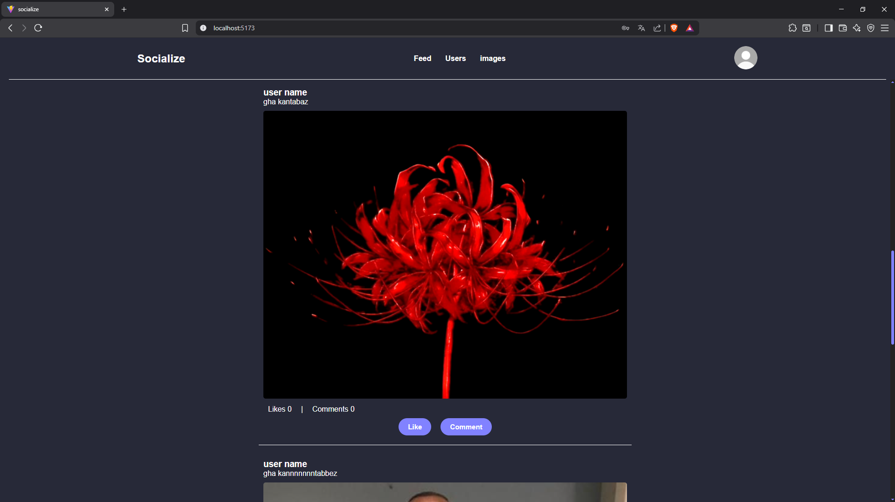

<!-- @format -->

# 🌐 Socialize

**Socialize** is a simple social media platform where users can register, log in, and view posts from others.
A post can be just text, or text combined with an image.

---

## 🔧 Prerequisites


---

## 📸 Screenshot - App Preview



---

## 🎥 Video Overview


---

## ✨ Features

- 🧑‍💻 User registration and login
- 📝 Create simple text posts
- 🖼️ Create posts with images
- 👀 View posts from other users
- 🚀 Clean React structure for easy modification

---

## 🛠️ Tech Stack

- **React.js**
- **React Router**
- **Redux**
- **CSS**
- **Json-Server as DB**
- **imgBB as a cloud server for images**

---

## 📦 Installation

```bash
git clone https://github.com/deepx18/socialize.git
cd socialize
npm install
```

---

## ▶️ Run the App

```bash
npm run dev
npx json-server .\src\database\db.json --port PORT
```

---

## 📁 Project Structure

```
src/
  components/
    Home.jsx
    Signin.jsx
    Signup.jsx
  database/
    db.json
  redux-files/
    store.js
  App.jsx
  App.css
  main.jsx
  index.css
```

---

## 📡 API Endpoints

| Method | Endpoint     | Description       |
| ------ | ------------ | ----------------- |
| GET    | /users       | Get all users     |
| POST   | /users       | Register new user |
| DELETE | /users?id=id | Delete a post     |
| GET    | /posts       | Get all posts     |
| POST   | /posts       | Create a post     |
| DELETE | /posts?id=id | Delete a post     |

---

## 🚀 Deployment

You can deploy Socialize using **Vercel**, **Netlify**, or **GitHub Pages**.

---

## 📄 License

This project is licensed under the MIT License.

---
